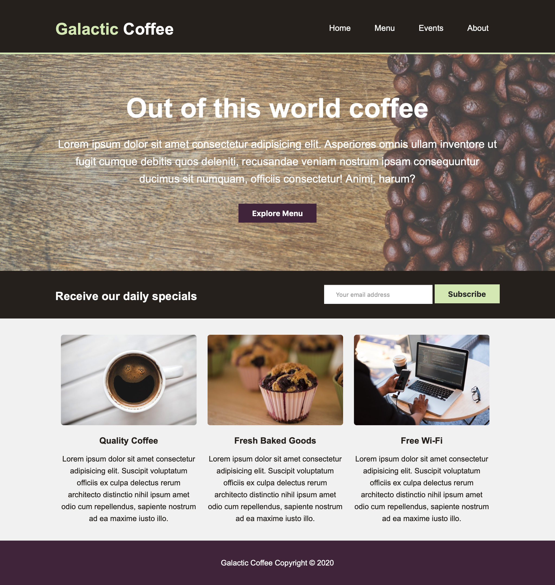

# Project 2 - CSS
In this project, your goal is develop CSS styles to finish the landing page for the ficitonal coffee shop *Galactic Coffee*. The HTML markup and images have already been provided. Below is an image of the finished site.

## Requirements
Please be sure that your site meets the following requirements:
* Modify only css/main.css in your project files. The HTML and images should not be modified.
* All the selectors I have used have been provided for you already in main.css. I have also place hints throughout the CSS to help you. You may start with the selectors and hints I gave you, or you may delete them and start the CSS (not the HTML) from scratch. It is up to you.
* *main.css* should be valid and pass the validator check from the W3C.
* The form will not be sent anywhere. No need to make sure that this is working from an email perspective.
* The *Galactic Coffee* branding and *Home* nav item point to index.html. All the rest of the links go nowhere (which is okay).

## Submission Guidelines
* Please do your best to use Git and GitHub for this assignment. If you run into trouble and don't want to deal with it anymore, you can submit your assignment by uploading to your repository rather than committing and pushing. If you do upload, make sure not to include your local git files in the upload.
* As mentioned before, **ONLY MODIFY the file css/main.css**. You should not modify any other files.
* This assignment will be due no later than Monday March 6th by midnight.
* When you are finished, you must submit your assignment via Blackboard. You do not need to provide any files, just a blank submission with a comment detailing your github username.